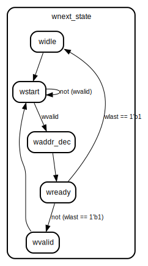

# Entity: axi_slave 
- **File**: axi_mem.sv

## Diagram

## Ports

| Port name | Direction | Type   | Description |
| --------- | --------- | ------ | ----------- |
| clk       | input     |        |             |
| resetn    | input     |        |             |
| awvalid   | input     |        |             |
| awready   | output    |        |             |
| awid      | input     | [3:0]  |             |
| awlen     | input     | [3:0]  |             |
| awsize    | input     | [2:0]  |             |
| awaddr    | input     | [31:0] |             |
| awburst   | input     | [1:0]  |             |
| wvalid    | input     |        |             |
| wready    | output    |        |             |
| wid       | input     | [3:0]  |             |
| wdata     | input     | [31:0] |             |
| wstrb     | input     | [3:0]  |             |
| wlast     | input     |        |             |
| bready    | input     |        |             |
| bvalid    | output    |        |             |
| bid       | output    | [3:0]  |             |
| bresp     | output    | [1:0]  |             |
| arready   | output    |        |             |
| arid      | input     | [3:0]  |             |
| araddr    | input     | [31:0] |             |
| arlen     | input     | [3:0]  |             |
| arsize    | input     | [2:0]  |             |
| arburst   | input     | [1:0]  |             |
| arvalid   | input     |        |             |
| rid       | output    | [3:0]  |             |
| rdata     | output    | [31:0] |             |
| rresp     | output    | [1:0]  |             |
| rlast     | output    |        |             |
| rvalid    | output    |        |             |
| rready    | input     |        |             |

## Signals

| Name                     | Type       | Description |
| ------------------------ | ---------- | ----------- |
| awaddrt                  | reg[31:0]  |             |
| wdatat                   | reg [31:0] |             |
| mem[128] = '{default:12} | reg [7:0]  |             |
| retaddr                  | reg [31:0] |             |
| nextaddr                 | reg [31:0] |             |
| first                    | reg        |             |
| boundary                 | reg[7:0]   |             |
| wlen_count               | reg[3:0]   |             |
| araddrt                  | reg[31:0]  |             |
| rdfirst                  | reg        |             |
| rdnextaddr               | bit[31:0]  |             |
| rdretaddr                | bit[31:0]  |             |
| len_count                | reg[3:0]   |             |
| rdboundary               | reg[7:0]   |             |

## Functions
- data_wr_fixed (input[3:0] wstrb,  input[31:0] awaddrt) return (bit[31:0])
- data_wr_incr (input[3:0] wstrb,  input[31:0] awaddrt) return (bit[31:0])
- wrap_boundary (input bit[3:0] awlen,  input bit[2:0] awsize) return (bit[7:0])
- data_wr_wrap (input[3:0] wstrb,  input[31:0] awaddrt,  input[7:0] wboundary) return (bit[31:0])
- read_data_fixed (input [31:0]addr,  input[2:0] arsize) return (void)
- read_data_incr (input [31:0] addr,  input[2:0] arsize) return (bit[31:0])
- read_data_wrap (input bit[31:0] addr,  input bit[2:0] rsize,  input[7:0] rboundary) return (bit[31:0])

## Processes
- unnamed: ( @(posedge clk, negedge resetn) )
  - **Type:** always_ff
- unnamed: (  )
  - **Type:** always_comb
- unnamed: (  )
  - **Type:** always_comb
- unnamed: (  )
  - **Type:** always_comb
- unnamed: ( @(posedge clk, negedge resetn) )
  - **Type:** always_ff
- unnamed: (  )
  - **Type:** always_comb
- unnamed: (  )
  - **Type:** always_comb

## State machines

